# flutter_confetti_engine

[](https://pub.dev/packages/flutter_confetti_engine)
[](LICENSE)
[](https://pub.dev/packages/flutter_lints)

A Flutter celebration package that unifies **confetti particle animation**, **haptic feedback**, and **optional sound** in a single API call.

- 🎉 Four built-in animation presets — `nova`, `cascade`, `flare`, `crossfire` (center burst, top shower, left/right edge streams)
- 🎭 Eight curated showcase modes — center pop, star field, emoji pop, dual stream, and more
- 🔊 **10 original synthesized sounds** bundled with the package — no asset setup required
- 📳 Smart haptic patterns that automatically match each preset
- 🎨 Full customization — colors, shapes, particle count, gravity, speed, lifetime
- 🛠️ Zero-config one-liner **or** a controller for precise lifecycle management
- 🧩 Works in overlays, dialogs, Stack widgets, or any constrained region

---

## Demo

Screen recordings from the bundled **[example](example/)** app (`flutter run` in `example/`). Factory **presets**, **showcase** modes, and **dialogs / messages** — **three clips per row**.

> **pub.dev:** Animated GIFs are stored in the Git repository only (not in the published package tarball). If images do not appear below, view this README on **[GitHub](https://github.com/iuzairaslam/flutter_confetti_engine)**.

<table>
<tr>
<td align="center" width="33%">
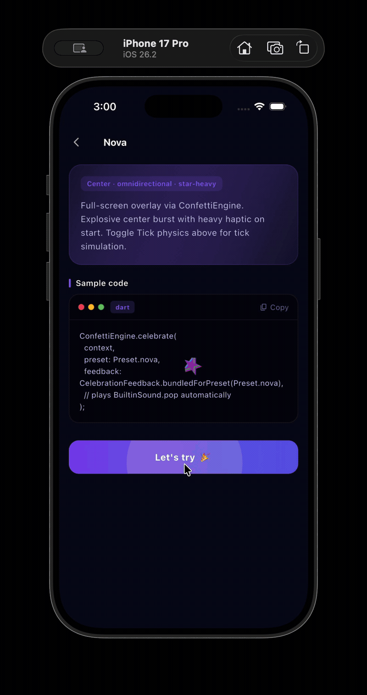<br/>
<strong>Nova</strong><br/>
<sub><code>Preset.nova</code></sub>
</td>
<td align="center" width="33%">
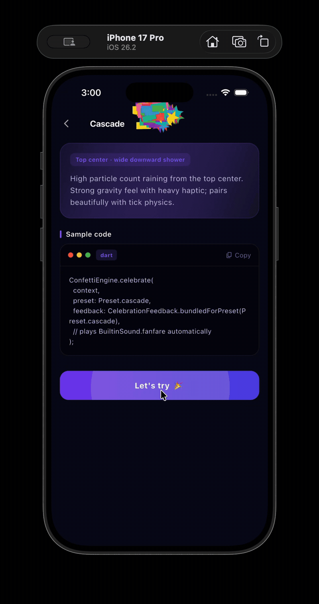<br/>
<strong>Cascade</strong><br/>
<sub><code>Preset.cascade</code></sub>
</td>
<td align="center" width="33%">
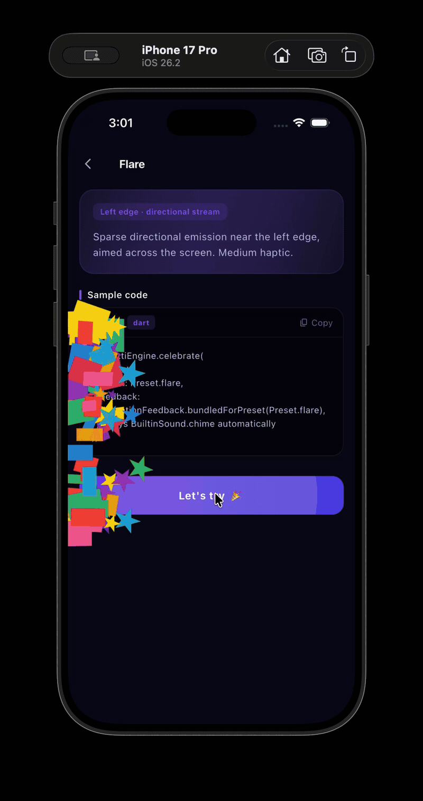<br/>
<strong>Flare</strong><br/>
<sub><code>Preset.flare</code></sub>
</td>
</tr>
<tr>
<td align="center">
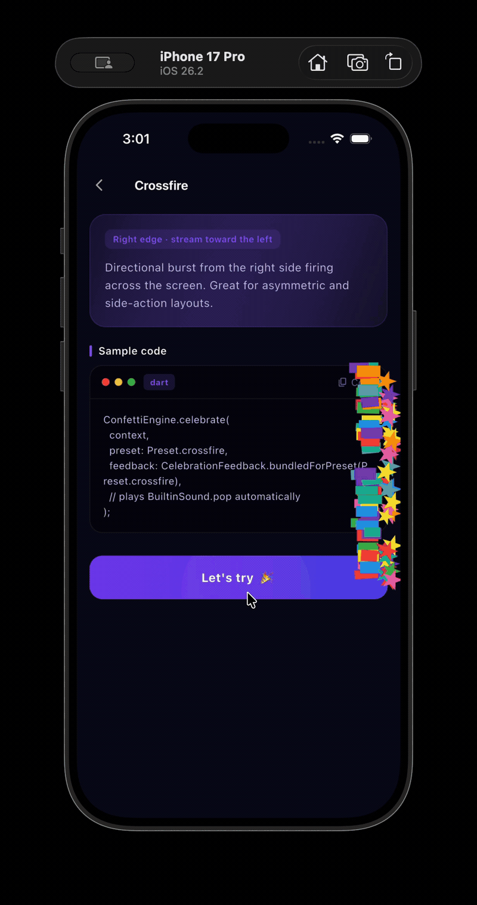<br/>
<strong>Crossfire</strong><br/>
<sub><code>Preset.crossfire</code></sub>
</td>
<td align="center">
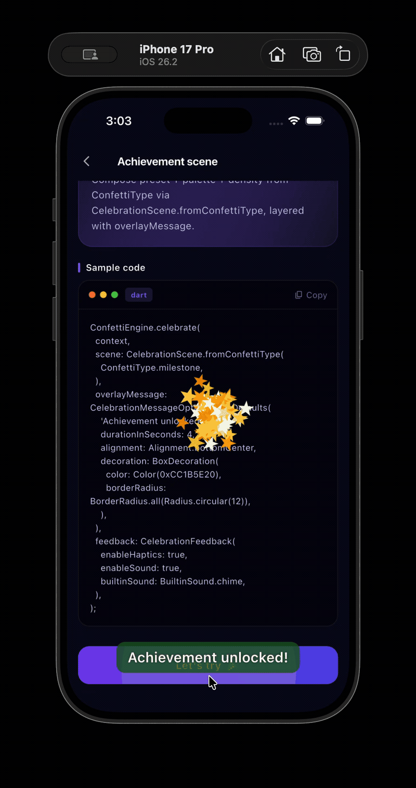<br/>
<strong>Achievement scene</strong><br/>
<sub><code>CelebrationScene</code> · banner</sub>
</td>
<td align="center">
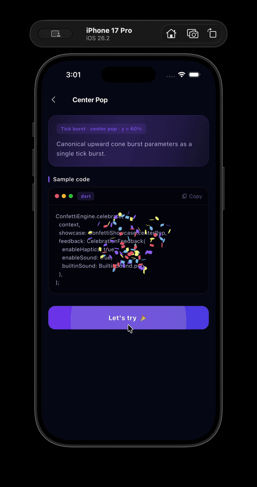<br/>
<strong>Center Pop</strong><br/>
<sub><code>ConfettiShowcase.centerPop</code></sub>
</td>
</tr>
<tr>
<td align="center">
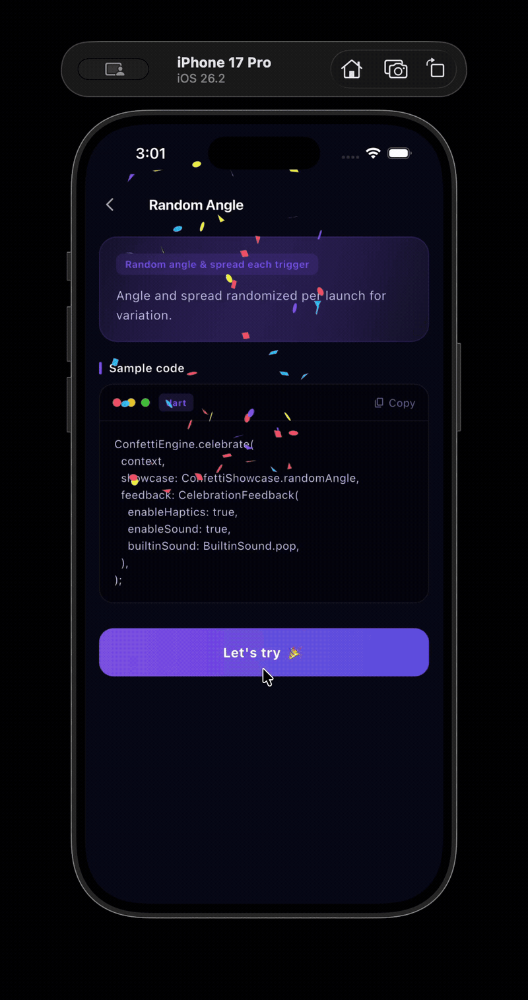<br/>
<strong>Random Angle</strong><br/>
<sub><code>ConfettiShowcase.randomAngle</code></sub>
</td>
<td align="center">
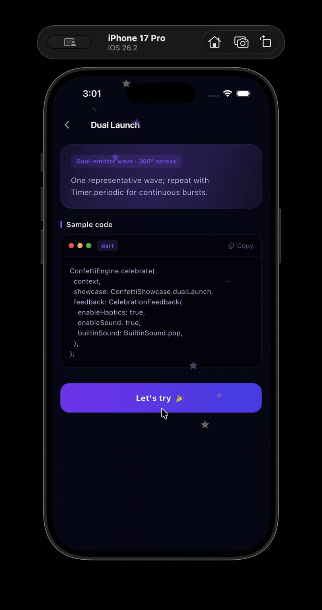<br/>
<strong>Dual Launch</strong><br/>
<sub><code>ConfettiShowcase.dualLaunch</code></sub>
</td>
<td align="center">
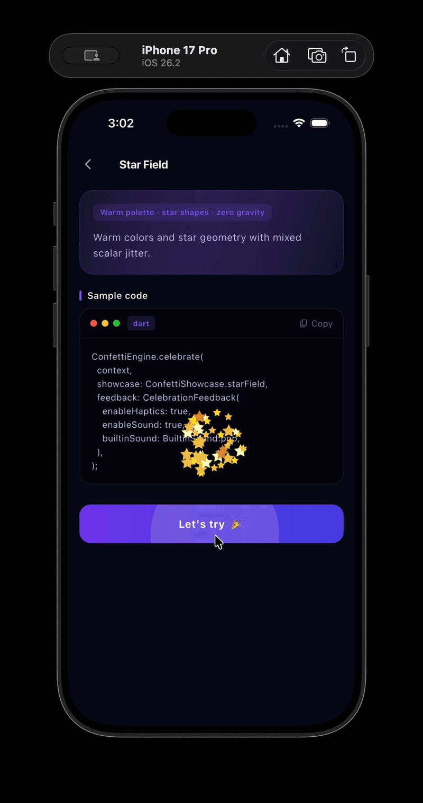<br/>
<strong>Star Field</strong><br/>
<sub><code>ConfettiShowcase.starField</code></sub>
</td>
</tr>
<tr>
<td align="center">
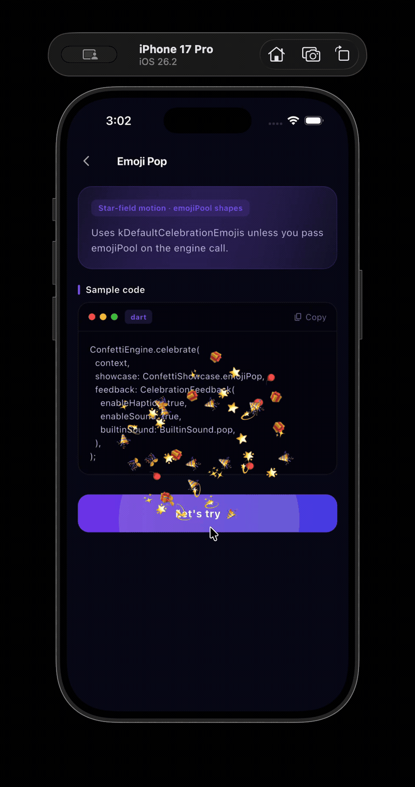<br/>
<strong>Emoji Pop</strong><br/>
<sub><code>ConfettiShowcase.emojiPop</code></sub>
</td>
<td align="center">
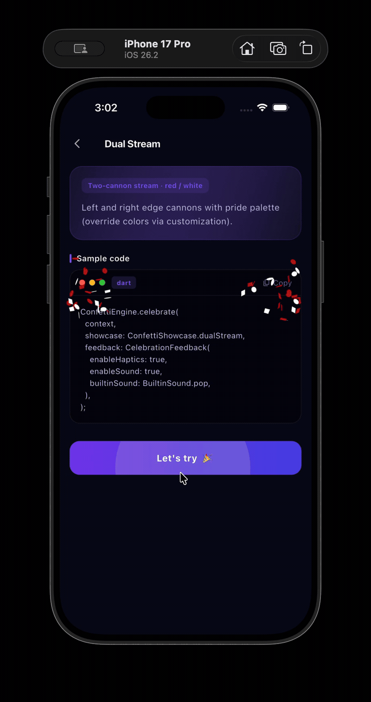<br/>
<strong>Dual Stream</strong><br/>
<sub><code>ConfettiShowcase.dualStream</code></sub>
</td>
<td align="center">
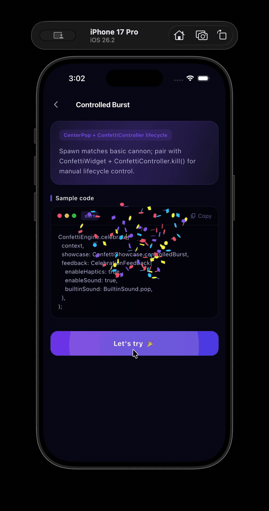<br/>
<strong>Controlled Burst</strong><br/>
<sub><code>ConfettiShowcase.controlledBurst</code></sub>
</td>
</tr>
<tr>
<td align="center">
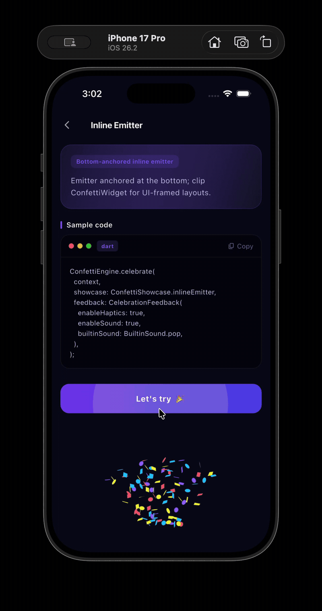<br/>
<strong>Inline Emitter</strong><br/>
<sub><code>ConfettiShowcase.inlineEmitter</code></sub>
</td>
<td align="center">
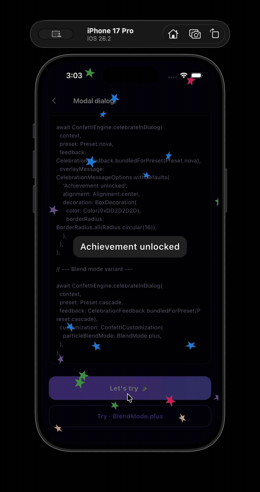<br/>
<strong>Modal dialog</strong><br/>
<sub><code>celebrateInDialog</code></sub>
</td>
<td align="center">
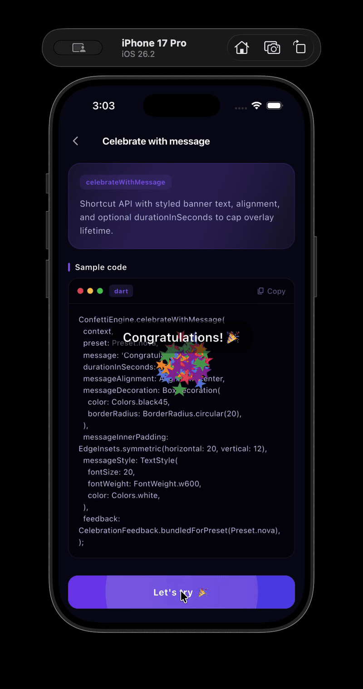<br/>
<strong>Celebrate with message</strong><br/>
<sub><code>celebrateWithMessage</code></sub>
</td>
</tr>
</table>

---

## Table of Contents

- [Demo](#demo)
- [Installation](#installation)
- [Quick Start](#quick-start)
- [Presets](#presets)
- [Showcase Modes](#showcase-modes)
- [Built-in Sounds](#built-in-sounds)
- [Haptic Feedback](#haptic-feedback)
- [ConfettiWidget](#confettiwidget)
- [Manual Controller](#manual-controller)
- [Customization](#customization)
- [Emoji Particles](#emoji-particles)
- [Overlay Message Banner](#overlay-message-banner)
- [Dialog Celebration](#dialog-celebration)
- [API Reference Summary](#api-reference-summary)

---

## Installation

Add to your `pubspec.yaml`:

```yaml
dependencies:
  flutter_confetti_engine: ^1.0.0
```

Then run:

```sh
flutter pub get
```

Import:

```dart
import 'package:flutter_confetti_engine/flutter_confetti_engine.dart';
```

> **No extra asset declarations needed.** All 10 built-in sounds are bundled with the package and auto-merged by Flutter.

---

## Quick Start

### One-liner full-screen burst

```dart
ConfettiEngine.celebrate(context);
```

### With a preset

```dart
ConfettiEngine.celebrate(context, preset: Preset.cascade);
```

### With built-in sound

```dart
// Auto-picks the right built-in clip for the preset
ConfettiEngine.celebrate(
  context,
  preset: Preset.nova,
  feedback: CelebrationFeedback.bundledForPreset(Preset.nova),
);
```

### Pick any built-in sound directly

```dart
ConfettiEngine.celebrate(
  context,
  feedback: const CelebrationFeedback(
    enableHaptics: true,
    enableSound: true,
    builtinSound: BuiltinSound.fanfare,
  ),
);
```

### With your own custom sound

```dart
// Register 'assets/sounds/cheer.mp3' in your app's pubspec.yaml first
ConfettiEngine.celebrate(
  context,
  feedback: CelebrationFeedback.customAsset('assets/sounds/cheer.mp3'),
);
```

### Dismiss programmatically

```dart
ConfettiEngine.dismiss();
```

---

## Presets

| Preset | Description | Default particles | Haptic |
|---|---|---|---|
| `Preset.nova` | Center screen — omnidirectional explosion | 120 | Heavy |
| `Preset.cascade` | Top center — wide downward shower | 200 | Heavy |
| `Preset.flare` | Left edge — directional stream to the right | 72 | Medium |
| `Preset.crossfire` | Right edge — directional stream to the left | 100 | Medium |

```dart
ConfettiEngine.celebrate(context, preset: Preset.nova);
ConfettiEngine.celebrate(context, preset: Preset.cascade);
ConfettiEngine.celebrate(context, preset: Preset.flare);
ConfettiEngine.celebrate(context, preset: Preset.crossfire);
```

---

## Showcase Modes

Showcase modes use tick-based physics for precise control over angle, spread, and decay. Pass a `ConfettiShowcase` value to `celebrate()` or `ConfettiWidget` — it overrides `preset`.

| Showcase | Description |
|---|---|
| `ConfettiShowcase.centerPop` | 100 particles, 70° spread, fires from screen center |
| `ConfettiShowcase.randomAngle` | Random angle (55–125°) and spread each time |
| `ConfettiShowcase.dualLaunch` | Two simultaneous emitters from random left/right positions |
| `ConfettiShowcase.starField` | Warm palette stars with zero gravity — floats in all directions |
| `ConfettiShowcase.emojiPop` | Same motion as starField using emoji particles |
| `ConfettiShowcase.dualStream` | Red/white dual cannons from left and right edges |
| `ConfettiShowcase.controlledBurst` | Same as centerPop — designed for use with `ConfettiController` |
| `ConfettiShowcase.inlineEmitter` | Bottom-center burst — great inside a clipped widget |

```dart
ConfettiEngine.celebrate(
  context,
  showcase: ConfettiShowcase.starField,
  feedback: const CelebrationFeedback(
    enableHaptics: true,
    enableSound: true,
    builtinSound: BuiltinSound.sparkle,
  ),
);
```

---

## Built-in Sounds

Ten **100% original, synthesized** celebration clips are shipped with the package. No internet download, no asset registration needed in your `pubspec.yaml`.

| Sound | Duration | Character | Best for |
|---|---|---|---|
| `BuiltinSound.pop` | ~0.4 s | Punchy confetti-popper snap | `nova`, `crossfire` |
| `BuiltinSound.chime` | ~2.2 s | Warm C-major bell chord | `flare`, gentle wins |
| `BuiltinSound.fanfare` | ~1.6 s | Triumphant ascending brass fanfare | `cascade`, achievements |
| `BuiltinSound.applause` | ~2.0 s | Crowd clapping and cheering | Leaderboards, completions |
| `BuiltinSound.whoosh` | ~0.55 s | Fast frequency sweep | `crossfire`, transitions |
| `BuiltinSound.drumroll` | ~1.6 s | Snare roll ending in cymbal crash | Reveals, countdowns |
| `BuiltinSound.levelUp` | ~1.0 s | 8-bit ascending arpeggio jingle | Game wins, level clears |
| `BuiltinSound.bell` | ~2.2 s | Clear resonant D5 bell | `flare`, notifications |
| `BuiltinSound.sparkle` | ~1.4 s | Magical high-freq twinkling | `starField`, `emojiPop` |
| `BuiltinSound.airhorn` | ~0.85 s | Bold air-horn blast | Sports wins, big milestones |

### Option 1 — Preset-matched clip (recommended)

```dart
ConfettiEngine.celebrate(
  context,
  preset: Preset.nova,
  feedback: CelebrationFeedback.bundledForPreset(Preset.nova),
  // → plays BuiltinSound.pop automatically
);
```

`bundledForPreset` maps:
- `nova` / `crossfire` → `BuiltinSound.pop`
- `cascade` → `BuiltinSound.fanfare`
- `flare` → `BuiltinSound.chime`

### Option 2 — Pick any clip directly

```dart
ConfettiEngine.celebrate(
  context,
  feedback: const CelebrationFeedback(
    enableHaptics: true,
    enableSound: true,
    builtinSound: BuiltinSound.drumroll,
  ),
);
```

### Option 3 — Your own audio file

```yaml
# In your app's pubspec.yaml
flutter:
  assets:
    - assets/sounds/party.mp3
```

```dart
ConfettiEngine.celebrate(
  context,
  feedback: CelebrationFeedback.customAsset('assets/sounds/party.mp3'),
);
```

> When both `builtinSound` and `soundAssetPath` are set, `soundAssetPath` wins.

### Get the raw asset path

```dart
final path = BuiltinSound.levelUp.assetPath;
// → 'packages/flutter_confetti_engine/assets/sounds/levelUp.wav'

final autoPath = ConfettiBundledSounds.pathForPreset(Preset.cascade);
// → 'packages/flutter_confetti_engine/assets/sounds/fanfare.wav'
```

---

## Haptic Feedback

Haptics are **on by default** and automatically tuned per preset:

| Preset / Showcase | Haptic pattern |
|---|---|
| `nova`, `cascade` | `HapticFeedback.heavyImpact()` |
| `flare`, `crossfire` | `HapticFeedback.mediumImpact()` |
| Most showcases | `HapticFeedback.heavyImpact()` |
| `randomAngle` | `HapticFeedback.mediumImpact()` |

Disable haptics:

```dart
ConfettiEngine.celebrate(
  context,
  feedback: const CelebrationFeedback(enableHaptics: false, enableSound: false),
);
```

---

## ConfettiWidget

Embed confetti inside your own widget tree — inside a `Stack`, constrained to a card, or clipped to a region.

### Auto-play (fire and forget)

```dart
Stack(
  children: [
    YourContent(),
    ConfettiWidget(preset: Preset.nova),
  ],
)
```

### With feedback

```dart
ConfettiWidget(
  preset: Preset.cascade,
  feedback: CelebrationFeedback.bundledForPreset(Preset.cascade),
  onComplete: () => print('Done!'),
)
```

### Showcase inside a widget

```dart
ConfettiWidget(
  showcase: ConfettiShowcase.dualStream,
  feedback: const CelebrationFeedback(
    enableHaptics: true,
    enableSound: true,
    builtinSound: BuiltinSound.airhorn,
  ),
)
```

---

## Manual Controller

Use `ConfettiController` when you need to start, stop, or reset the animation from your own state.

```dart
class _MyWidgetState extends State<MyWidget> {
  final _ctrl = ConfettiController();

  @override
  void dispose() {
    _ctrl.dispose();
    super.dispose();
  }

  @override
  Widget build(BuildContext context) {
    return Stack(
      children: [
        YourContent(),
        ConfettiWidget(
          preset: Preset.flare,
          controller: _ctrl,
          autoPlay: false,
        ),
        ElevatedButton(
          onPressed: _ctrl.play,
          child: const Text('Celebrate!'),
        ),
      ],
    );
  }
}
```

Controller states:

```dart
_ctrl.play();   // Start / restart animation
_ctrl.stop();   // Pause (particles freeze in place)
_ctrl.kill();   // Stop and clear all particles immediately
```

---

## Customization

Override particle count, colors, shapes, and physics using `ConfettiCustomization`:

```dart
ConfettiEngine.celebrate(
  context,
  preset: Preset.nova,
  customization: ConfettiCustomization(
    particleCount: 200,
    colors: [Colors.pink, Colors.purple, Colors.cyan],
    shapeMix: [ParticleShape.star, ParticleShape.circle],
    gravity: 300,          // px/s² — lower = floatier
    speedMultiplier: 1.5,
    lifetimeMultiplier: 1.2,
  ),
);
```

### Available shapes

```
ParticleShape.circle     ParticleShape.square     ParticleShape.triangle
ParticleShape.star       ParticleShape.paper       ParticleShape.ribbon
ParticleShape.pentagon   ParticleShape.hexagon     ParticleShape.ring
ParticleShape.lightning  ParticleShape.crescent    ParticleShape.arrow
ParticleShape.emoji
```

### Tick-based physics

```dart
ConfettiEngine.celebrate(
  context,
  preset: Preset.nova,
  customization: ConfettiCustomization(
    useTickBasedPhysics: true,
    tickSpawnOptions: const TickConfettiSpawnOptions(
      angle: 90,
      spread: 45,
      startVelocity: 60,
      decay: 0.95,
      gravity: 1,
      ticks: 300,
      scalar: 1.2,
    ),
  ),
);
```

---

## Emoji Particles

Customize the emoji pool for `ParticleShape.emoji` particles:

```dart
ConfettiEngine.celebrate(
  context,
  showcase: ConfettiShowcase.emojiPop,
  emojiPool: const ['🏆', '🎯', '💎', '🚀', '⚡'],
);
```

Default emojis (used when no pool is supplied): 🎉 🎊 ⭐ 🌟 ✨ 💫 🎈 🎁

---

## Overlay Message Banner

Show a styled text banner on top of the confetti:

```dart
ConfettiEngine.celebrate(
  context,
  preset: Preset.nova,
  feedback: const CelebrationFeedback(
    enableHaptics: true,
    enableSound: true,
    builtinSound: BuiltinSound.fanfare,
  ),
  overlayMessage: CelebrationMessageOptions.withDefaults(
    '🏆 You did it!',
    durationInSeconds: 3,
    alignment: Alignment.center,
    decoration: BoxDecoration(
      color: const Color(0x99000000),
      borderRadius: BorderRadius.circular(16),
    ),
  ),
);
```

Or use the convenience method:

```dart
ConfettiEngine.celebrateWithMessage(
  context,
  message: 'Level Complete! 🎊',
  preset: Preset.cascade,
  feedback: const CelebrationFeedback(
    enableHaptics: true,
    enableSound: true,
    builtinSound: BuiltinSound.levelUp,
  ),
  messageAlignment: Alignment.bottomCenter,
  durationInSeconds: 4,
);
```

---

## Dialog Celebration

Show confetti inside a transparent full-screen dialog:

```dart
await ConfettiEngine.celebrateInDialog(
  context,
  preset: Preset.nova,
  feedback: const CelebrationFeedback(
    enableHaptics: true,
    enableSound: true,
    builtinSound: BuiltinSound.fanfare,
  ),
  overlayMessage: CelebrationMessageOptions.withDefaults(
    'Achievement Unlocked! 🏆',
    durationInSeconds: 3,
    alignment: Alignment.center,
  ),
  onComplete: () => print('Dialog closed'),
);
```

The dialog auto-dismisses when particles finish or when `durationInSeconds` elapses.

---

## API Reference Summary

### `ConfettiEngine`

| Method | Description |
|---|---|
| `celebrate(context, {...})` | Full-screen overlay, auto-removes on completion |
| `celebrateWithMessage(context, message, {...})` | Overlay + styled text banner |
| `celebrateInDialog(context, {...})` | Modal transparent dialog |
| `dismiss()` | Immediately remove any active overlay |

### `ConfettiWidget`

| Parameter | Type | Default | Description |
|---|---|---|---|
| `preset` | `Preset` | `Preset.nova` | Animation style |
| `showcase` | `ConfettiShowcase?` | `null` | Overrides preset when set |
| `controller` | `ConfettiController?` | `null` | For manual lifecycle |
| `autoPlay` | `bool` | `true` | Start automatically after layout |
| `feedback` | `CelebrationFeedback?` | `null` | Grouped haptic + sound settings |
| `enableHaptics` | `bool` | `true` | Ignored when `feedback` is set |
| `enableSound` | `bool` | `false` | Ignored when `feedback` is set |
| `soundAssetPath` | `String?` | `null` | Custom audio path |
| `emojiPool` | `List<String>?` | `null` | Custom emoji characters |
| `customization` | `ConfettiCustomization?` | `null` | Count, colors, physics overrides |
| `onComplete` | `VoidCallback?` | `null` | Called when all particles fade |

### `CelebrationFeedback`

| Factory / Constructor | Description |
|---|---|
| `CelebrationFeedback(...)` | Full manual control |
| `CelebrationFeedback.none()` | No haptics, no sound |
| `CelebrationFeedback.hapticsOnly()` | Haptics only, no sound |
| `CelebrationFeedback.bundledForPreset(preset)` | Auto-picks the right built-in clip |
| `CelebrationFeedback.customAsset(path)` | Your own audio file |

### `BuiltinSound`

| Value | Duration | Character |
|---|---|---|
| `BuiltinSound.pop` | ~0.4 s | Punchy confetti-popper snap |
| `BuiltinSound.chime` | ~2.2 s | Warm C-major bell chord |
| `BuiltinSound.fanfare` | ~1.6 s | Triumphant brass fanfare |
| `BuiltinSound.applause` | ~2.0 s | Crowd clapping and cheering |
| `BuiltinSound.whoosh` | ~0.55 s | Fast frequency sweep |
| `BuiltinSound.drumroll` | ~1.6 s | Snare roll + cymbal crash |
| `BuiltinSound.levelUp` | ~1.0 s | 8-bit arpeggio jingle |
| `BuiltinSound.bell` | ~2.2 s | Clear resonant D5 bell |
| `BuiltinSound.sparkle` | ~1.4 s | Magical high-freq twinkling |
| `BuiltinSound.airhorn` | ~0.85 s | Bold air-horn blast |

---

## License

MIT — see [LICENSE](LICENSE) for details.
